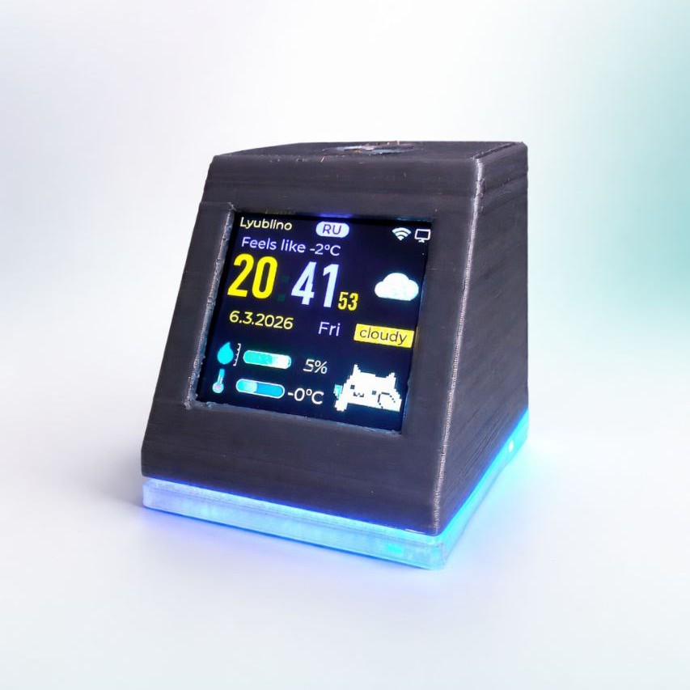
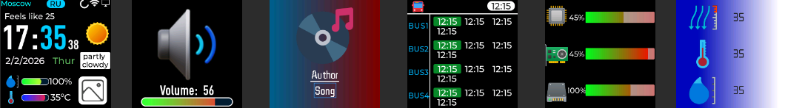

# ESP Widget

<p align="center">
  
</p>

<p align="center">
  Настольный ESP32-S3 виджет с отображением времени, погоды, автобусов, загрузки ПК,
  музыки, громкости и локальных данных с датчиков. Управление и настройка выполняются
  через Windows-приложение на Flet и локальный backend.
</p>

<p align="center">
  <strong>ESP32-S3</strong> • <strong>LVGL</strong> • <strong>Flet</strong> • <strong>aiohttp</strong> • <strong>WebSocket</strong>
</p>

## О проекте

`ESP Widget` состоит из трех частей:

- прошивка для устройства на `ESP32-S3`;
- desktop-приложение на `Python + Flet`;
- локальный backend, который связывает ПК и устройство по `HTTP`, `UDP discovery` и `WebSocket`.

Проект задуман как настольный информационный виджет: устройство показывает нужные данные на экране и подсветке, а приложение на ПК позволяет быстро менять настройки без перепрошивки.

## Логика работы устройства

После включения устройство инициализирует экран, LED-подсветку, сенсорную кнопку, файловую систему `LittleFS` и сохраненные настройки из `Preferences`.

Дальше логика такая:

- если устройство еще не настроено, оно поднимает собственную Wi-Fi точку доступа `deskhub` и открывает страницу первичной настройки;
- после подключения к домашней сети устройство ищет ПК через `UDP discovery` и подключается к backend по `WebSocket`;
- backend передает на устройство настройки интерфейса, расписание, погодные данные, команды OTA и GIF-анимации;
- на основном экране устройство показывает время, дату, погоду и статус соединения;
- экран автобусов использует локально сохраненный кэш расписания;
- экран мониторинга ПК начинает получать `CPU`, `GPU` и `RAM` только когда этот экран реально открыт;
- при смене трека и изменении громкости устройство показывает отдельные оверлеи;
- sleep mode по расписанию отключает экран и подсветку, а после выхода восстанавливает предыдущую яркость;
- настройки цветов, яркости, сна, GIF и LED-режимов сохраняются в памяти устройства.

## Логика управления устройством

Основное управление идет через сенсорную кнопку `TTP223` и через desktop-приложение.

### Управление с кнопки

- `1 нажатие` — переход по экранам вперед: главный экран -> автобусы -> мониторинг ПК -> системный экран -> снова главный;
- `2 нажатия` — переход по экранам назад;
- `3 и более нажатий` — переключение LED-режима с сохранением нового значения;
- `удержание около 2 секунд` — принудительное переподключение к backend;
- в sleep mode одно нажатие временно включает экран для предпросмотра.

### Управление с ПК

Через приложение и backend можно:

- менять яркость экрана и яркость подсветки;
- менять режим и цвет LED-подсветки;
- менять цвета элементов интерфейса;
- настраивать погоду, координаты и расписание;
- отправлять GIF-анимации на устройство;
- запускать OTA-обновление;
- делать factory reset;
- включать автозапуск backend в Windows;
- устанавливать готовую сборку через installer.

## Галерея

Все оверлеи устройства

<p align="center">
  
</p>

## Что умеет проект

### Устройство

- показывает время, дату и домашний экран с погодой;
- загружает погодные данные по координатам;
- отображает температуру, влажность и давление с `BME280`;
- показывает расписание автобусов;
- отображает загрузку `CPU`, `GPU`, `RAM`;
- показывает название трека и исполнителя при смене музыки;
- показывает оверлей громкости при изменении системного уровня звука;
- поддерживает GIF-анимации;
- поддерживает sleep mode по расписанию;
- на первом запуске поднимает собственную Wi-Fi точку доступа для настройки;
- обновляется по OTA;
- поддерживает настраиваемую LED-подсветку с режимами `Static`, `Rainbow`, `Breathing`, `Music`, `Confetti`, `Aurora`, `Prism`.

### Desktop-приложение

В `Flet`-интерфейсе есть вкладки для:

- главной панели со статусом соединения и прогрессом GIF/OTA;
- настройки цветов элементов экрана;
- загрузки GIF и удаления лишних кадров перед отправкой;
- настройки яркости экрана;
- настройки яркости, цвета и режима подсветки;
- общих настроек: погода, координаты, расписание, sleep mode, OTA URL;
- factory reset;
- OTA-обновления устройства.

Дополнительно приложение:

- сохраняет настройки через backend;
- умеет включать автозапуск backend в Windows;
- может автоматически стартовать backend при первом запуске;
- может работать как готовый `exe` через installer.

### Backend

Backend отвечает за синхронизацию между ПК и ESP:

- поднимает локальный HTTP API на `http://127.0.0.1:8787`;
- хранит настройки в `pc_service/backend/storage/settings.json`;
- поднимает WebSocket-сервер для ESP;
- рассылает `UDP discovery`, чтобы устройство нашло IP компьютера;
- передает на устройство команды, настройки, цвета, GIF и OTA;
- отслеживает музыку в Windows через `winsdk`;
- отслеживает громкость через `pycaw`;
- отправляет на устройство загрузку `CPU`, `GPU`, `RAM`;
- парсит расписание автобусов и сохраняет локальный кэш;
- используется как локальный сервис для desktop-приложения и installer-сборки.

## На чем сделано

### Железо

Устройство собрано на:

- `ESP32-S3 Zero`
- `ST7789 240x240`
- `BME280`
- `TTP223`
- `WS2812B`
- `Buzzer` (опционально)

### Firmware

- `PlatformIO`
- `Arduino framework`
- `LVGL 8`
- `LovyanGFX`
- `LittleFS`
- `WebSockets`
- `FastLED`
- `ArduinoJson`
- `Adafruit BME280`

### Desktop / Backend

- `Python`
- `Flet`
- `aiohttp`
- `websockets`
- `Pillow`
- `psutil`
- `winsdk`
- `pycaw`
- `BeautifulSoup`

### Внешние сервисы

- `OpenWeatherMap` для погодных данных на устройстве;
- `Open-Meteo` для brightness/weather логики на стороне ПК;
- `transport.mos.ru` как источник расписания автобусов.

## Архитектура

```text
Flet UI
   -> HTTP API (aiohttp)
      -> ESP service
         -> UDP discovery
         -> WebSocket
            -> ESP32-S3 firmware
```

Дополнительно backend получает данные из Windows и отправляет их на устройство:

- музыка;
- громкость;
- загрузка ПК;
- сохраненные настройки;
- пользовательские цвета интерфейса.

## API backend

Основные endpoint'ы:

- `GET /api/status` — статус подключения ESP, состояние GIF и OTA;
- `GET /api/settings` — текущие настройки;
- `PUT /api/settings` — сохранить настройки и отправить diff на устройство;
- `POST /api/esp/command` — произвольная команда на устройство;
- `POST /api/esp/color` — изменить цвет конкретного элемента UI;
- `POST /api/esp/display` — настройки экрана;
- `POST /api/esp/backlight` — настройки подсветки;
- `POST /api/esp/gif` — передача GIF;
- `POST /api/esp/ota` — OTA-команда.

## Быстрый старт

### Desktop + backend

```bash
pip install -r requirements.txt
python pc_service/backend/main.py
python pc_service/ui/app.py
```

По умолчанию UI ожидает backend на `127.0.0.1:8787`.

### Сборка Windows-релиза

```powershell
powershell -ExecutionPolicy Bypass -File .\installer\scripts\build_windows_release.ps1
```

### Сборка установщика

```powershell
& "C:\Program Files (x86)\Inno Setup 6\ISCC.exe" ".\installer\esp-widget.iss"
```

Итоговый установщик:

```text
dist\ESPWidgetInstaller.exe
```

После установки backend может быть зарегистрирован для автозапуска через Планировщик заданий Windows.

### Firmware

```bash
cd firmware
pio run
```

Для загрузки на плату:

```bash
pio run -t upload
```

Если используется `LittleFS`, отдельно загрузи файловую систему:

```bash
pio run -t uploadfs
```

## Структура репозитория

```text
pc_service/   backend и desktop-приложение
firmware/     прошивка ESP32-S3 и ресурсы LittleFS
installer/    Inno Setup-скрипт и сборка Windows-релиза
docs/images/  изображения для README
```

## Особенности проекта

- desktop-часть ориентирована на `Windows`, потому что использует `winsdk`, `pycaw` и автозапуск через `Task Scheduler`;
- backend и прошивка умеют восстанавливать сохраненные настройки и цвета после переподключения;
- в проекте есть готовый Windows-установщик на базе `Inno Setup`.
